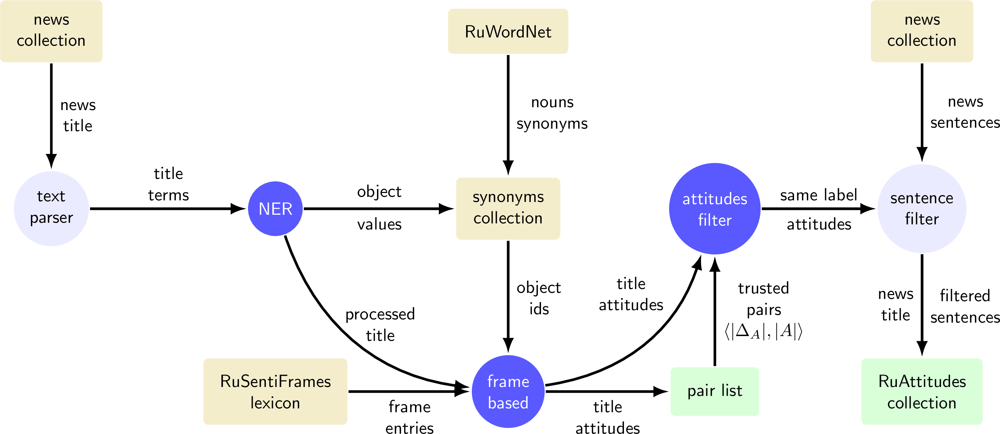

# RuAttitudes 1.0

**RuAttitudes** -- is a collection of automatically labeled sentiment attitudes,
which is developed using **distant supervision** (DS) approach.
It is considered as an application for machine learning model training.
This repository provides a collection and **reader** (written in Python).
The collection has been developed and verbosely described in following paper:

* Distant Supervision for Sentiment Attitude Extraction
[[paper]](),
[[poster]](docs/ranlp_2019_poster_portrait.pdf)
    * Rusnachenko Nikolay, Loukachevitch Natalia, Tutubalina Elena
    * RANLP-2019

## Introduction

News articles often convey attitudes between the mentioned subjects, which is essential for understanding the described situation.

This RuAttitudes is a result collection of an application of a new approach to distant supervision for **extracting sentiment attitudes
between mentioned named entities in text**.

>**Example**: ``... **[USA]** is considering the possibility of new sanctions against
    **[Russia]** ... ''. This context illustrates a negative **USA🠆Russia** attitude.
## How We Created a Training Set

We use two different methods of sentiment attitude annotation, applied to the news title:
* **Pair-Based** -- utilizing the [pre-assigned attitudes](data/auth_list.txt),
organized in a list of pairs;
* **Frame-Based** -- utilizing frame entries from the
[RuSentiFrames](https://github.com/nicolay-r/RuSentiFrames)
lexicon.

We intersect the annotations and separate result:
* With the **different** polarity according to both sources.
* With the **same** polarity -- is a result collection (RuAttitudes);

Figure below illustrates training collection development flow.



## Quick Start: Format Description

* The template of each line is as follows:

```
    [KEYWORD] ':' [VALUE] [OPTIONS]
```

* Checkout [sample](sample.txt);

* Checkout [reader example](read.py), written in Python.


## Detailed Options Description

Options presented in case of the following keywords:
1. **Object**;
2. **Attitude**;
3. **FrameVariant**.

##### For **Object** keyword

```
Object: 'сша' b:(3,1) oi:[1] si:{0} d:ner <AUTH>
```

* b:(```position```, ```length```) -- **b**eginning position description.
    * ```position``` -- index of word, starts with 0;
    * ```length``` -- length of related object in words.
* oi:[```line_index```] -- **O**bject **I**ndex.
    * ```line_index``` -- an unsigned int value, is a reference to the **Object**;
* si:{```index```} -- **S**ynonym **I**ndex.
    * ```index``` -- index of synonym group, if synonym group exists; otherwise ```-1``` value used.
* d:```type``` -- a method by which named entity has been extracted,
where ```type``` denotes:
    * ```ner``` -- entity has been found using
    [NER tool](https://github.com/nicolay-r/ner-flask-wrapper)
    (Bi-LSTM+CRF model)
    [[paper]](https://arxiv.org/pdf/1603.01360.pdf);
    * ```restored``` -- entity was missed by NER but **restored** using a
    [list of authorized objects](data/auth_list.txt) (see NOTE);
* ```<AUTH>``` -- optional; if present, denotes that related object is belong a
    [list of authorized object](data/auth_list.txt) (see NOTE);

>NOTE: List of authorized objects list presented in a form of **relations**, where each relation has
the following format: ```source```->```target```.

>Object ```x``` is belong the list of authorised objects, when there is at least a single relation
with
```source == x``` or
```target == x```.

##### For **Attitude** keyword

```
Attitude: 'сша'->'украина' b:(1) oi:[1, 2] si:{0,180}
```

* b:(```score```) -- Sentiment score of the related atittude.
    * ```score``` -- integer value; ```1``` -- positive, ```-1``` -- negative.

* oi:[```source```, ```target```] -- **O**bject **I**ndex.
    * ```source``` -- unsigned int value, is a reference to the **Object**;
    * ```target``` -- unsigned int value, is a reference to the **Object**;

* si:{```source```, ```target```} -- **s**ynonym **i**ndices of ```source``` and ```target```.
    * ```source``` -- index of synonym group;
    * ```target``` -- index of synonym group;

##### For **FrameVariant** keyword

```
FrameVariant: помогать (6, 1) b:[a0->a1[pos]] id:(0_8)
```

* (```position```, ```length```) -- position description.
    * ```position``` -- index of word, starts with 0;
    * ```length``` -- length of related object in words.

* b:[a0->a1[```score```]] -- sentiment score of a relation ```A0->A1```
(according to [RuSentiFrames](https://github.com/nicolay-r/RuSentiFrames)).
```score``` parameter could have one of the following values:
    * ```pos``` -- denotes a positive sentiment
    * ```neg``` -- denotes a negative sentiment

* id:(``id``) -- identifier in RuSentiFrames lexicon:
    * ``id`` -- key in json dictionary of [RuSentiFrames](https://github.com/nicolay-r/RuSentiFrames) lexicon;

## Collection Reader 

Folder `reader` contains a collection reader (source file parsers), written in Python-3.6.

Please refer to [read.py](read.py), as it provides an example of how this collection could be parsed/readed.

## Application and Experiments

1. Application in Sentiment Attitude Classification Task of Analytical Articles, written in Russian
[[code-repository]](https://github.com/nicolay-r/attitudes-extraction-ds).

## References

> NOTE: This section will be updated since the related paper become available at aclweb.
